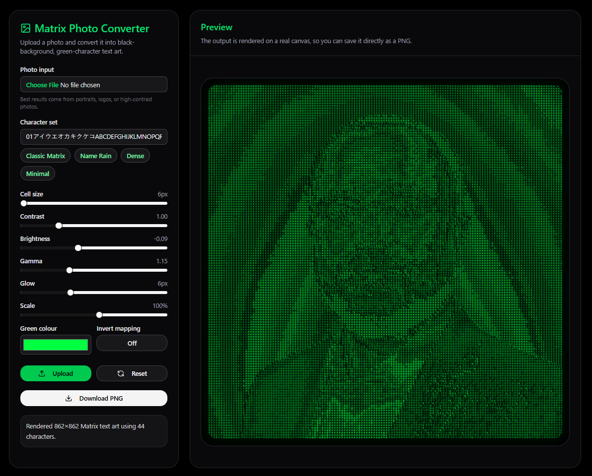

# 🟢 Matrix Photo to Text Art Converter

Convert any photo into **Matrix-style text art** using bright green characters on a black background.

This project is a **single HTML + JavaScript application** — no installation required. Just open the file in a browser and start converting instantly.

---

## 🎬 Demo

  

---

## 🚀 Features

- ✅ Upload any image (PNG, JPG, WEBP)
- ✅ Convert into Matrix-style text art
- ✅ Black background + green character output
- ✅ Customisable character sets (including names)
- ✅ Adjustable visual controls
- ✅ Live preview rendering
- ✅ Download output as PNG
- ✅ No installation or dependencies

---

## 📂 How to Run

1. Download or clone the repository  
2. Open the file: Matrix_Photo_Converter.html

3. Double-click the file OR open it in any modern browser

✅ No setup required

---

## 🧠 How It Works

- The image is loaded into a hidden canvas
- Each pixel block is analysed for brightness (luminance)
- Brightness is mapped to a character from a defined set
- Characters are rendered to form the final image
- Result = Matrix-style text-based image

---

## 📸 How to Use the App

### Step 1 — Upload Image
- Click **Photo Input**
- Select any image file

---

### Step 2 — Adjust Settings (optional)
- Modify character set or use presets
- Adjust sliders for visual quality

---

### Step 3 — Render Output
- Click **Render** (or it updates automatically)

---

### Step 4 — Download Result
- Click **Download PNG**
- Image will be saved locally

---

## ⚙️ Configuration Options Explained

| Setting | Description |
|--------|-------------|
| Character Set | Characters used to form the image (e.g., Matrix symbols or your name) |
| Cell Size | Controls detail level (smaller = more detail) |
| Contrast | Enhances difference between light and dark areas |
| Brightness | Adjusts overall light/dark tone |
| Gamma | Controls tonal balance (important for faces) |
| Glow | Adds Matrix-style green glow |
| Scale | Controls size/resolution of output |
| Invert Mapping | Reverses light/dark mapping |

---

## 🎯 Recommended Settings

### 🔍 High Detail (Best for faces / logos)
- Cell Size: `6 – 8`
- Contrast: `1.2 – 1.5`
- Gamma: `0.9 – 1.2`
- Glow: `2 – 5`

---

### 🟢 Classic Matrix Look
- Character Set: 01アイウエオカキクケコABCDEFGHIJKLMNOPQRSTUVWXYZ@#$%&*

- Glow: `6 – 10`
- Contrast: `1.1 – 1.3`
- Green Colour: `#00ff41`

---

### 👤 Name-Based Effect (Custom Text Art)
- Character Set: John Appleseed

- Cell Size: `10 – 14`
- Contrast: `1.3+`

---

### 🎨 Clean / Minimal Style
- Character Set: █▓▒░ .

- Cell Size: `8 – 12`
- Glow: `0 – 2`

---

## 📱 Use Cases

- Matrix-style wallpapers
- Profile pictures / avatars
- Cyberpunk posters
- Presentations / demos
- Data visualisation experiments

---

## ⚠️ Limitations

- Works best with:
- High-contrast images
- Clear subjects (faces, logos)
- Large images may take longer to process
- Runs entirely in the browser (no GPU acceleration)

---

## 🧩 Future Enhancements

- Animated Matrix effect
- Video-to-text conversion
- Real-time webcam mode
- Multi-colour rendering
- Depth-aware mapping

---

## 📜 License

Open-source and free to use.

---

## ✨ Author

Built as a lightweight, no-install Matrix-style visual tool using pure web technologies.

